# Install Java run time and Nifi
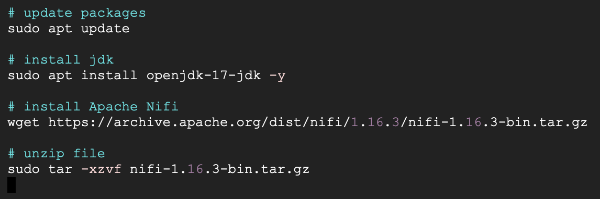

# nifi.properties configuration
This part is for modify the Nifi configuration to enable access to GCP

open nifi.properties file and modify these following parts
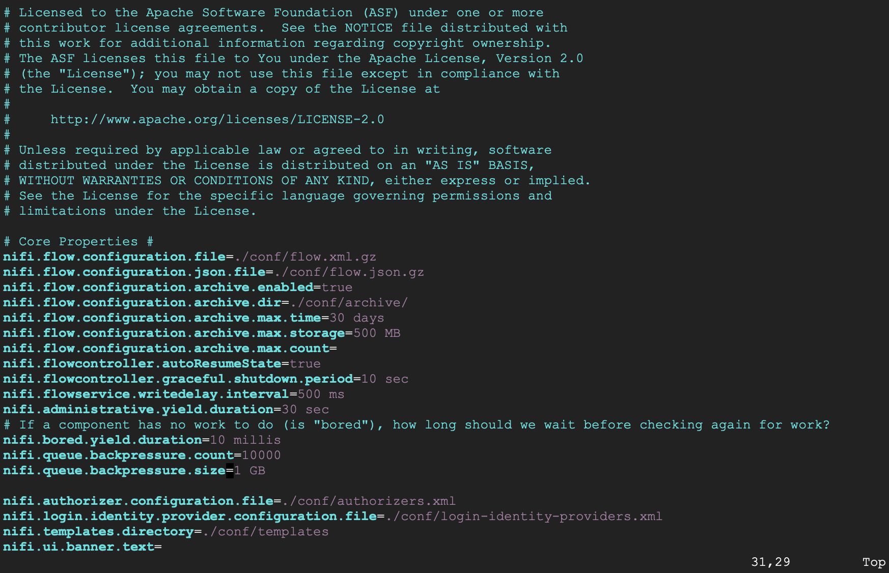

---------------------------------------
`nifi.remote.input.http.enabled = false`

### Web properties
`nifi.web.http.host=`

`nifi.web.http.port=8080`

`nifi.web.https.host=`

`nifi.web.https.port=`

### Security properties

`nifi.security.keystore=`

`nifi.security.keystoreType=`

`nifi.security.keystorePasswd=`

`nifi.security.keyPasswd=`

`nifi.security.truststore=`

`nifi.security.truststoreType=`

`nifi.security.truststorePasswd=`

<!-- Setup firewall for the application -->
## Navigate to Firewall policies
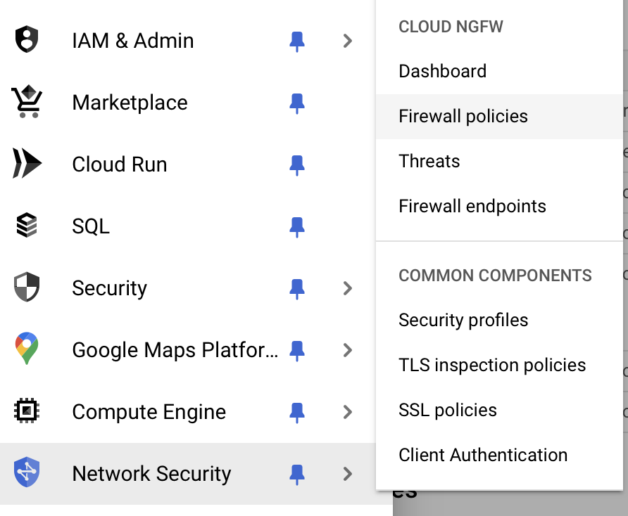

## Configure firewall for application
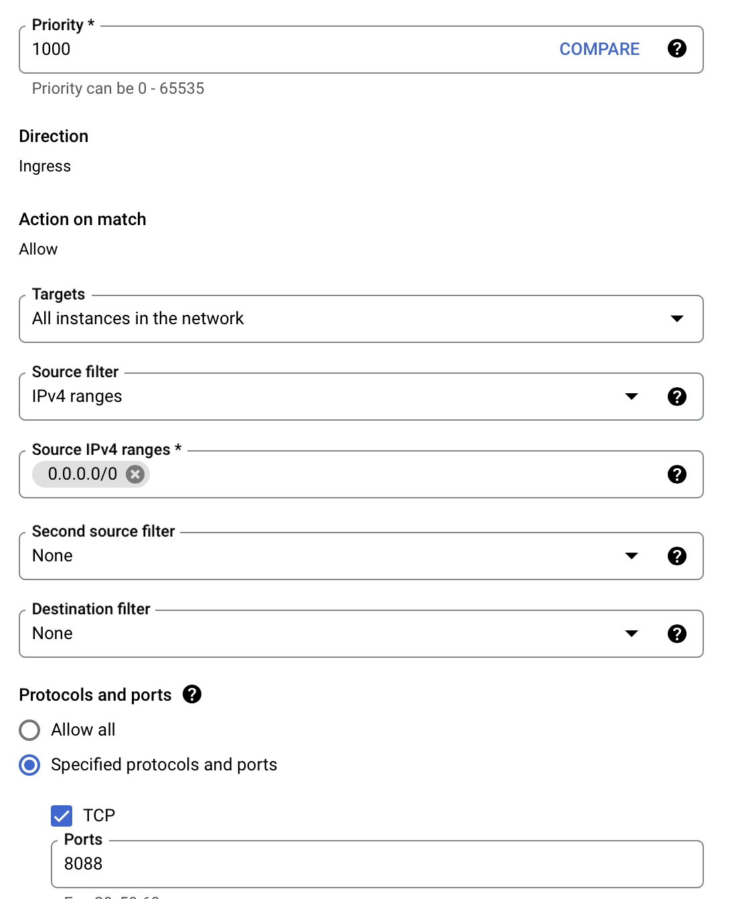

## Access Nifi through external ip provided by Compute Engine

`http://34.27.62.59:8088/nifi/`

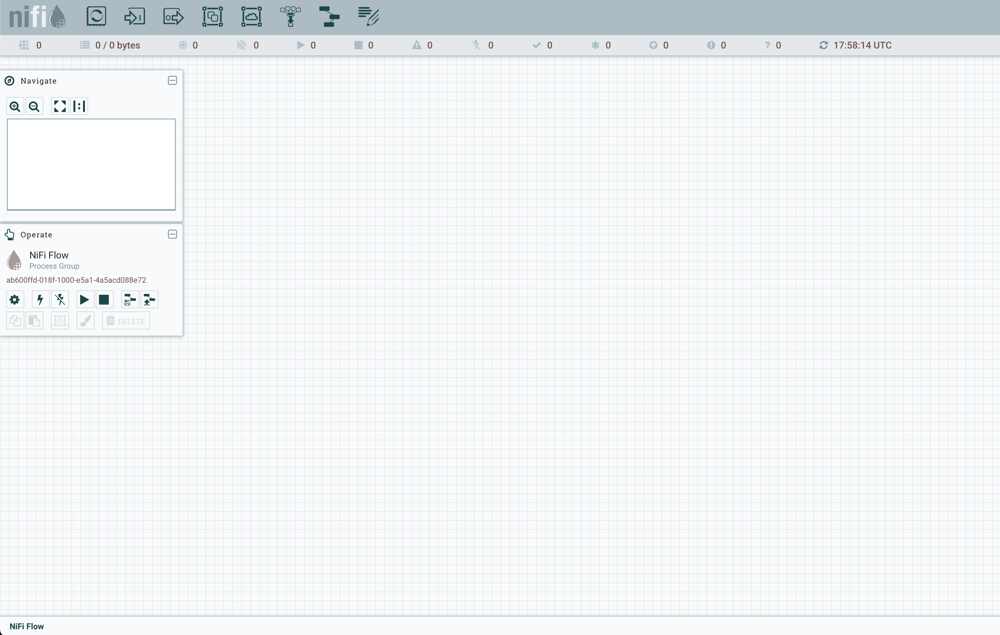

## Overall flow of Nifi
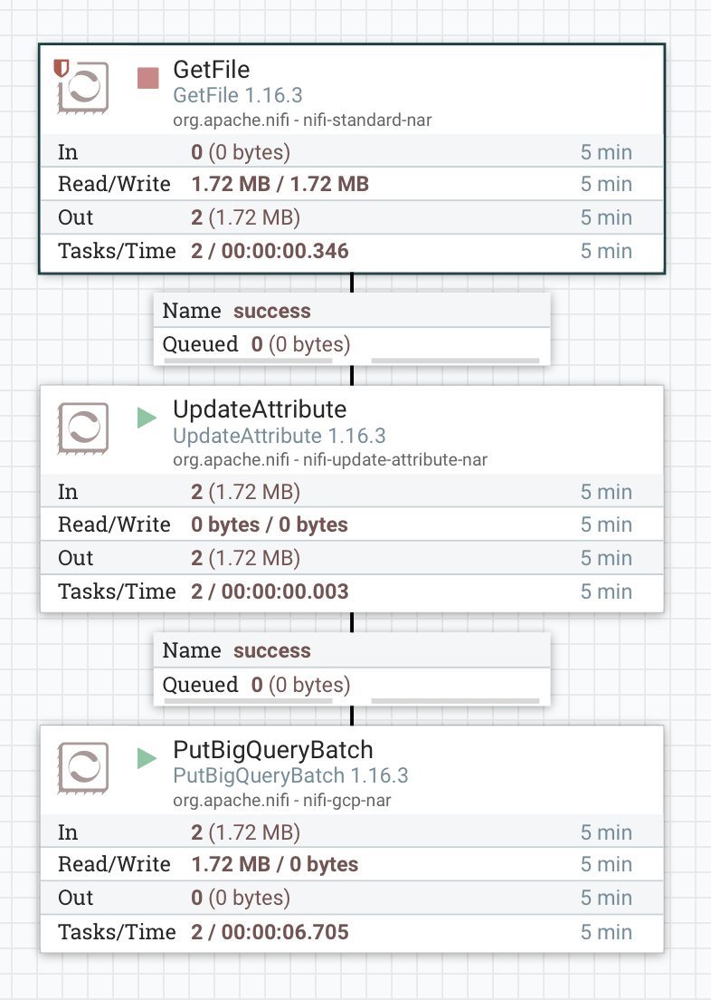

Flow bao gồm 3 Processor chính

`GetFile`: dùng để lấy thông tin của file cần chuyển

`UpdateAttribute`: dùng để update/edit thêm các thuộc tính của FlowFile

`PutBigQueryBatch`: đẩy file lên BigQuery

## Processor detail

Configuration for GetFile processor
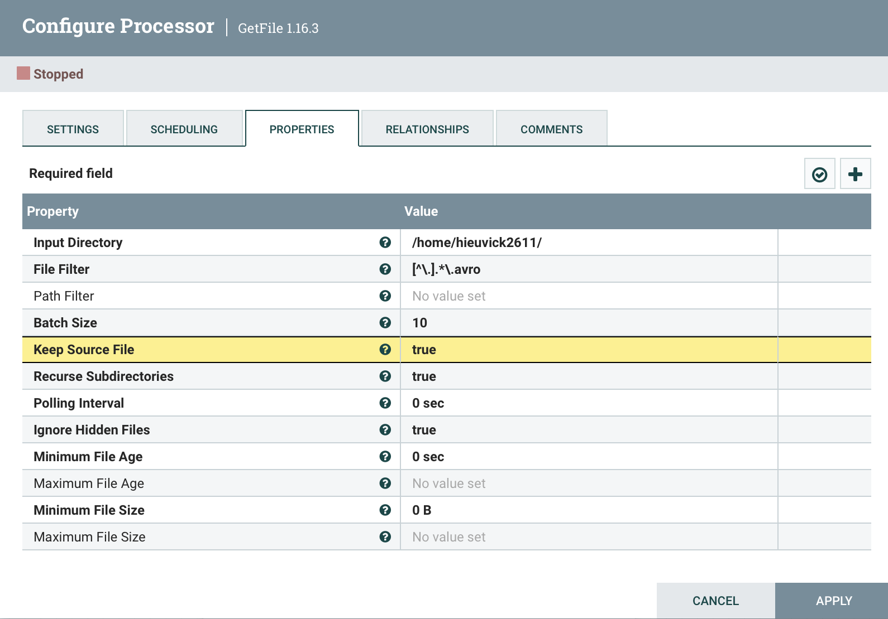

Configuration for UpdateAttributes processor
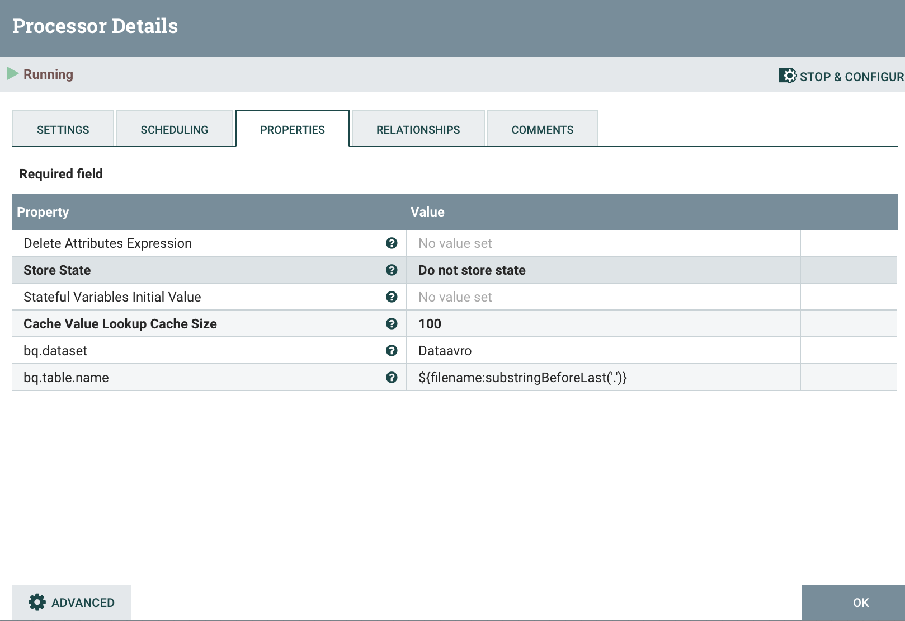

Configuration for PutBigQueryBatch
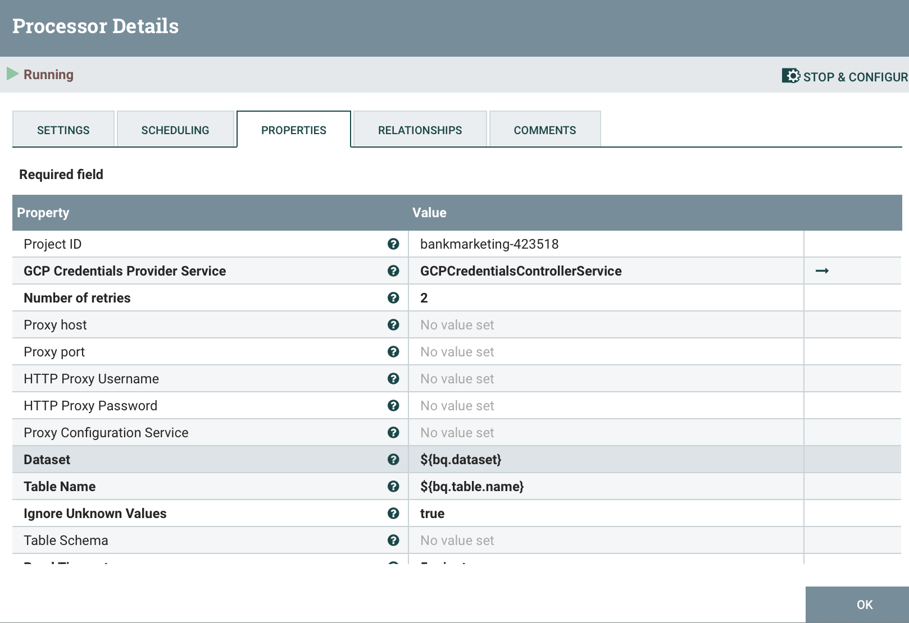

# Apache Airflow

## Overall workflow

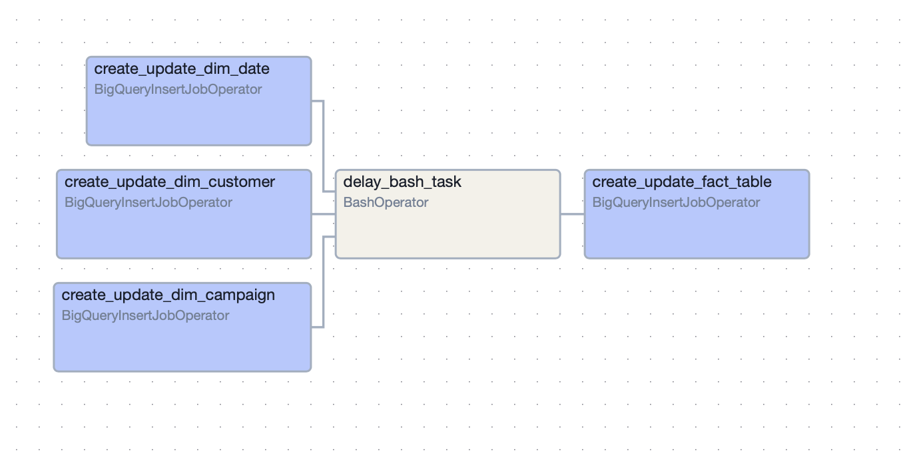

The overall workflow include the first 3 operator responsible for creating Dim tables from the raw data source. After finish created there is a 5s in delay time. Lastly there is an operator responsible for creating Fact table.

## Running Dags

Press run and the process should start right away
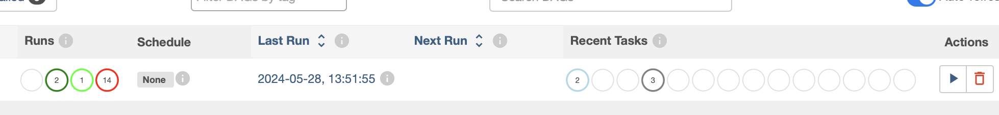

if all process turn green means that dags run successfully
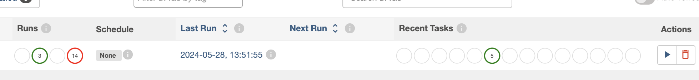

in BigQuery you should see the all created dim and fact table
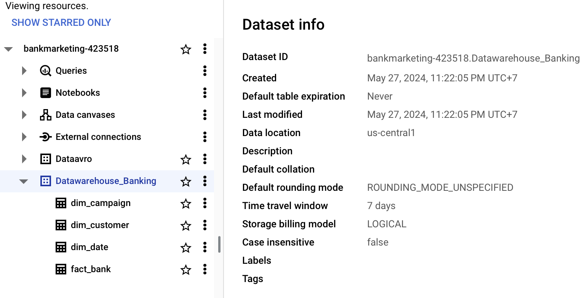

